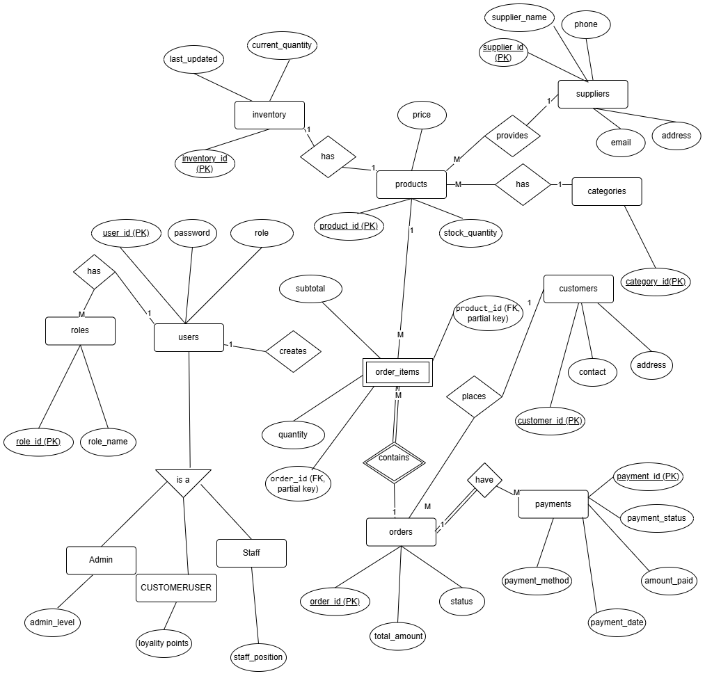

# Grocery Store Management System (POS)

> A comprehensive, web-based Point of Sale (POS) and inventory management solution tailored for modern grocery businesses.


## 📖 Introduction

The **Grocery Store Management System** is a robust web application designed to streamline the daily operations of a grocery store. It provides a centralized platform for managing sales, inventory, customers, and suppliers, replacing manual record-keeping with an efficient, digital workflow.

Built with a modern tech stack and database design principles, this system ensures data integrity, real-time reporting, and a seamless user experience for store administrators and cashiers.


## 🚀 functionalities & Features

*   **Point of Sale (POS)**: Efficient "New Order" interface for quick checkout with barcode support and receipt generation.
*   **Inventory Management**: Real-time tracking of stock levels, low-stock alerts, and automated inventory updates.
*   **Product & Category Management**: Easy-to-use interface for adding, updating, and organizing products and categories.
*   **Supplier Management**: Track supplier details and manage supply chains effectively.
*   **Customer Relationship Management (CRM)**: Maintain customer profiles.
*   **Interactive Dashboard**: Visual insights into sales performance, best-selling items, and key metrics.
*   **Secure Authentication**: Role-based access control to ensure system security.
*   **Reports & Analytics**: Generate PDF invoices and sales reports.

## 🛠️ Tech Stack

This project utilizes the **PERN/MERN** stack architecture (using MySQL):

*   **Frontend**: Restricted to [React.js](https://reactjs.org/) with [Vite](https://vitejs.dev/) for blazing fast build times.
*   **Styling**: [Tailwind CSS](https://tailwindcss.com/) for a modern, responsive user interface.
*   **Backend**: [Node.js](https://nodejs.org/) & [Express.js](https://expressjs.com/) for a scalable REST API.
*   **Database**: [MySQL](https://www.mysql.com/) for reliable relational data storage.
*   **Icons**: [Lucide React](https://lucide.dev/) for beautiful, consistent iconography.

## 📂 Documentation

Detailed project documentation and proposals can be found in the `docs` directory:

*   📄 [Project Proposal](./docs/proposal_db_project_HafizMuhammadHaris_70143269_v3.pdf)
*   📄 [Full Documentation](./docs/Db_Project_Documentation_70143269_Haris%20v2.pdf)

### Database Design (EER Diagram)

The system is built on a normalized relational database schema to ensure efficiency and scalability.



## 💻 Installation & Setup Instructions

Follow these steps to clone and run the project locally.

### Prerequisites

*   **Node.js** (v14 or higher)
*   **MySQL Server** running locally
*   **Git**

### 1. Clone the Repository

```bash
git clone https://github.com/harisizm/GROCERY-MANAGEMENT-SYSTEM.git
cd GROCERY-MANAGEMENT-SYSTEM
```

### 2. Database Setup

1.  Log in to your MySQL Workbench or Command Line.
2.  Create a new database (e.g., `grocery_db`).
3.  Import the schema and seed data located in `server/database`:

```sql
-- First, run the schema creation script
source server/database/schema.sql;

-- (Optional) Run the seed script to populate dummy data
source server/database/seed.sql;
```

### 3. Backend Setup

Navigate to the server directory and install dependencies:

```bash
cd server
npm install
```

Create a `.env` file in the `server` directory with your database credentials:

```env
PORT=3000
DB_HOST=localhost
DB_USER=root
DB_PASSWORD=your_password
DB_NAME=grocery_db
JWT_SECRET=your_jwt_secret_key
```

Start the backend server:

```bash
npm run dev
```

### 4. Frontend Setup

Open a new terminal, navigate to the client directory, and install dependencies:

```bash
cd client
npm install
```

Start the frontend development server:

```bash
npm run dev
```

### 5. Access the Application

Open your browser and navigate to the URL shown in your terminal (usually `http://localhost:5173`).

## 👨‍💻 Author

**Hafiz Muhammad Haris**
*   BS Software Engineering
*   Project ID: 70143269

---

*This project was developed for the Database Systems semester project.*
